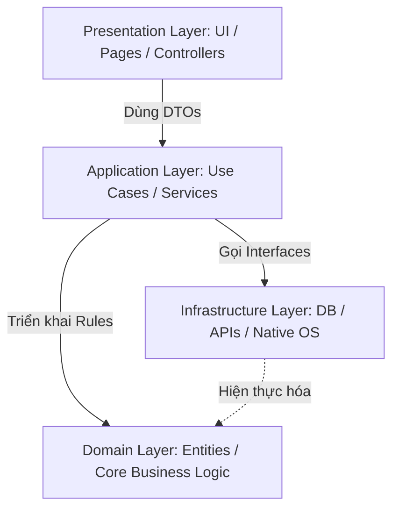
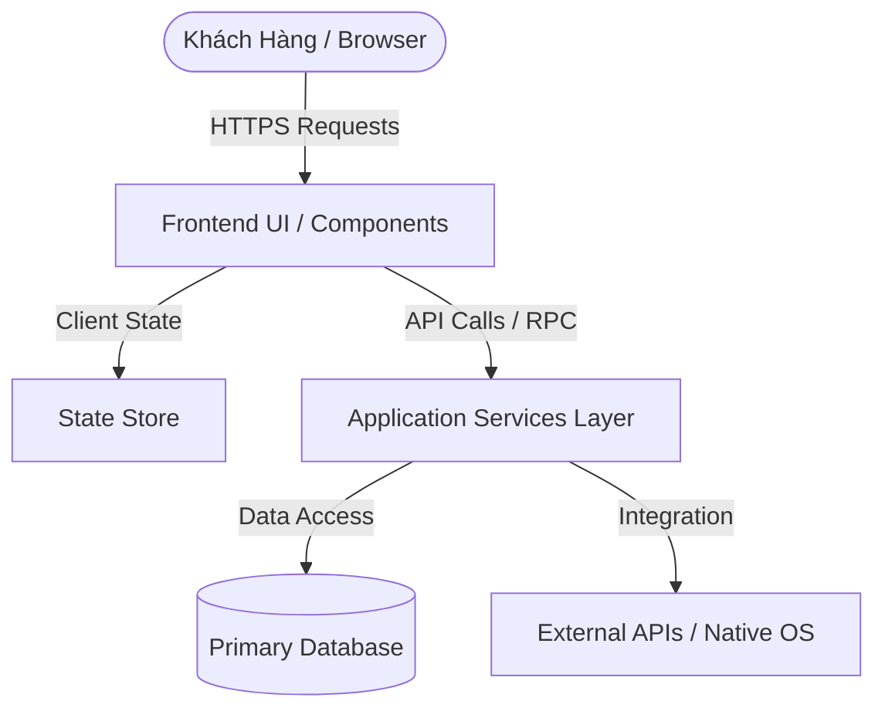

# BỘ QUY CHUẨN QUẢN TRỊ KỸ THUẬT: RULES.MD

> **Tiêu chuẩn:** Technical Planning and Execution Governance (TPEG-v3 Enterprise)  
> **Phạm vi hiệu lực:** Toàn cục (Bắt buộc áp dụng cho mọi dự án, bài toán kiến trúc, tái cấu trúc mã nguồn và xử lý sự cố trong hệ sinh thái Antigravity & Gemini)  
> **Cấp độ thực thi:** Cưỡng chế tự động và toàn diện (Zero-Tolerance Policy)  
> **Nguyên tắc chỉ đạo tối cao:** Hoạch định trước khi Thực thi (Plan-Before-Execute) — *Gemini Thinks. Antigravity Works.*

---

## MỤC LỤC
1. [PHẦN I: CÁC TIÊN ĐỀ BẤT BIẾN (FUNDAMENTAL AXIOMS)](#phần-i-các-tiên-đề-bất-biến-fundamental-axioms)
2. [PHẦN II: QUY CHUẨN THIẾT KẾ KIẾN TRÚC PHẦN MỀM (ARCHITECTURE & CODE STANDARDS)](#phần-ii-quy-chuẩn-thiết-kế-kiến-trúc-phần-mềm-architecture--code-standards)
3. [PHẦN III: QUY CHUẨN GIAO DIỆN & KỸ THUẬT FRONTEND (UI/UX & COMPONENT ENGINEERING)](#phần-iii-quy-chuẩn-giao-diện--kỹ-thuật-frontend-uiux--component-engineering)
4. [PHẦN IV: QUY CHUẨN BACKEND, CƠ SỞ DỮ LIỆU & BẤT ĐỒNG BỘ (BACKEND, DB & CONCURRENCY)](#phần-iv-quy-chuẩn-backend-cơ-sở-dữ-liệu--bất-đồng-bộ-backend-db--concurrency)
5. [PHẦN V: PHÒNG NGỪA CẠM BẪY MÔI TRƯỜNG & NỀN TẢNG (PLATFORM & OS TRAP PREVENTION)](#phần-v-phòng-ngừa-cạm-bẫy-môi-trường--nền-tảng-platform--os-trap-prevention)
6. [PHẦN VI: PHÂN RÃ WBS & ƯỚC LƯỢNG TIẾN ĐỘ PERT](#phần-vi-phân-rã-wbs--ước-lượng-tiến-độ-pert)
7. [PHẦN VII: RÀNG BUỘC PHẠM VI & SỔ NHẬT KÝ RAID (SCOPE & PRE-MORTEM)](#phần-vii-ràng-buộc-phạm-vi--sổ-nhật-ký-raid-scope--pre-mortem)
8. [PHẦN VIII: QUY TRÌNH THỰC THI CỦA TÁC TỬ AI & KIỂM THỬ (AI AGENT & TDD PROTOCOL)](#phần-viii-quy-trình-thực-thi-của-tác-tử-ai--kiểm-thử-ai-agent--tdd-protocol)
9. [PHẦN IX: TRÁCH NHIỆM GIẢI TRÌNH & ĐỊNH NGHĨA HOÀN THÀNH (DRI & DOD)](#phần-ix-trách-nhiệm-giải-trình--định-nghĩa-hoàn-thành-dri--dod)
10. [PHẦN X: BIỂU MẪU KẾ HOẠCH TIÊU CHUẨN (MANDATORY PLAN TEMPLATE)](#phần-x-biểu-mẫu-kế-hoạch-tiêu-chuẩn-mandatory-plan-template)

---

## PHẦN I: CÁC TIÊN ĐỀ BẤT BIẾN (FUNDAMENTAL AXIOMS)

### 1.1. KHÔNG KẾ HOẠCH, KHÔNG HÀNH ĐỘNG (PLAN-BEFORE-EXECUTE)
- Mọi can thiệp vào mã nguồn, cấu hình hệ thống hoặc quy trình vận hành đều bắt buộc phải bắt đầu bằng một Kế hoạch Kỹ thuật (Technical Implementation Plan) được phê chuẩn.
- Tuyệt đối nghiêm cấm hành động dựa trên cảm tính, phỏng đoán hoặc phương pháp thử-sai (trial-and-error). Mọi dòng mã được viết ra phải có lý do kỹ thuật và vị trí được hoạch định trước.

### 1.2. NGUYÊN TẮC BẰNG CHỨNG THỰC CHỨNG (EVIDENCE-BASED GROUNDING)
- Mọi đề xuất trong kế hoạch phải được chứng minh bằng hiện trạng thực tế (mã nguồn hiện hữu, cấu hình tệp cụ thể, nhật ký lỗi hệ thống, hoặc số liệu quan sát).
- Nghiêm cấm hoàn toàn hành vi bịa đặt thông tin, ảo tưởng hạ tầng hoặc tạo thực thể ảo không tồn tại trong workspace. Đường dẫn tệp, tên hàm, và biến môi trường phải có thật 100%.

### 1.3. KỶ LUẬT PHẠM VI CỐT LÕI (SCOPE DISCIPLINE & ANTI-SCOPE CREEP)
- Kế hoạch chỉ tập trung giải quyết mục tiêu kỹ thuật cốt lõi đã cam kết.
- Tuyệt đối nghiêm cấm: tối ưu hóa sớm (premature optimization), tái cấu trúc vượt phạm vi (out-of-scope refactoring), hoặc bổ sung các tính năng tiện ích không được yêu cầu.

### 1.4. DỪNG KHI GẶP ẨN SỐ (HALT-ON-UNKNOWN PROTOCOL)
- Khi phát hiện thiếu hụt thông số kỹ thuật chí mạng (ví dụ: thiếu schema DB, thiếu API spec, không rõ phiên bản hệ điều hành hoặc xung đột kiến trúc), **LẬP TỨC DỪNG** tiến trình lập kế hoạch và phát hành yêu cầu làm rõ định lượng (`Status: HALT`).
- Tuyệt đối không được phép tự suy diễn các giả định chưa được kiểm chứng để vẽ kế hoạch giả tạo.

### 1.5. PHÂN ĐỊNH NÃO BỘ VÀ TAY CHÂN (BRAIN VS. HARNESS)
- **Google Gemini giữ vai trò NÃO BỘ (Brain):** Độc quyền tư duy phản biện, lập luận kiến trúc sâu, kiểm toán rủi ro và lập kế hoạch tổng thể.
- **Antigravity giữ vai trò KHUNG THỰC THI (Harness):** Đọc kế hoạch, phân tích mã nguồn cục bộ, điều phối công cụ, chạy lệnh shell và kiểm thử tự động.
- Khi có yêu cầu lập kế hoạch (qua `/antigravity-with-gemini` hoặc câu lệnh lập plan), Antigravity **BẮT BUỘC PHẢI GỌI TOOL `gemini_plan`** (hoặc CLI `g2a plan`), **TUYỆT ĐỐI KHÔNG ĐƯỢC TỰ SUY NGHĨ HOẶC TỰ VIẾT PLAN** trong context của mình.
- Kế hoạch phải được lưu xuống đĩa tại `.g2a/plans/` và chỉ chuyển giao con trỏ siêu nhẹ (< 50 tokens) về cho Antigravity để triệt tiêu context bloat.

---

## PHẦN II: QUY CHUẨN THIẾT KẾ KIẾN TRÚC PHẦN MỀM (ARCHITECTURE & CODE STANDARDS)

### 2.1. MÔ HÌNH KIẾN TRÚC PHÂN TẦNG RÕ RÀNG (CLEAN LAYERED ARCHITECTURE)
Mọi hệ thống phần mềm phải được phân tách thành 4 tầng ranh giới độc lập:
1. **Presentation / UI Layer:** Thành phần giao diện, trang, và tiếp nhận input từ người dùng. Không chứa business logic hay gọi trực tiếp database.
2. **Application / Service Layer:** Điều phối luồng nghiệp vụ (use cases), quản lý transaction và tích hợp dịch vụ ngoài.
3. **Domain Layer:** Chứa entities, business rules cốt lõi và các interfaces thuần túy, hoàn toàn độc lập với frameworks hoặc thư viện ngoài.
4. **Infrastructure / Persistence Layer:** Triển khai truy xuất cơ sở dữ liệu, gọi network/API, đọc tệp hệ điều hành.



### 2.2. QUY CHUẨN HỢP ĐỒNG DỮ LIỆU & TYPE SAFETY TUYỆT ĐỐI
- **Zero `any` Policy:** Tuyệt đối cấm sử dụng kiểu `any` trong toàn bộ codebase TypeScript. Mọi biến, tham số hàm, và giá trị trả về phải có kiểu rõ ràng (`strict: true`).
- **Data Transfer Objects (DTO):** Mọi payload truyền qua ranh giới API, Network hoặc IPC đều phải được định nghĩa bằng Interface/Type rõ ràng.
- **Runtime Schema Validation:** Tất cả dữ liệu đến từ bên ngoài (User Input, Query params, Body payload, Third-party Webhook, File input) bắt buộc phải được thẩm định tại runtime bằng thư viện schema chuẩn (Zod, TypeBox, Pydantic, Joi).

### 2.3. NGUYÊN TẮC THIẾT KẾ MÃ NGUỒN SẠCH (SOLID & DRY)
- **Single Responsibility (SRP):** Mỗi module, class, hoặc function chỉ đảm nhiệm chính xác một trách nhiệm duy nhất. File không vượt quá 300 dòng; function không vượt quá 50 dòng.
- **Open/Closed (OCP):** Mở rộng tính năng bằng cách bổ sung adapter/plugin mới, không can thiệp sửa đổi các module lõi đang chạy ổn định.
- **Dependency Inversion (DIP):** Các tầng bậc cao không phụ thuộc trực tiếp vào tầng bậc thấp; cả hai phải phụ thuộc vào abstraction (Interfaces).

---

## PHẦN III: QUY CHUẨN GIAO DIỆN & KỸ THUẬT FRONTEND (UI/UX & COMPONENT ENGINEERING)

### 3.1. THIẾT KẾ THEO NGUYÊN TẮC ATOMIC COMPONENT
- Mọi thành phần giao diện phải được phân rã theo cấu trúc Atomic Design:
  - *Atoms:* Button, Input, Icon, Typography, Badge.
  - *Molecules:* SearchBar (Input + Button), FormField (Label + Input + Error).
  - *Organisms:* ProductCard, NavigationBar, CartSummaryTable.
  - *Templates/Pages:* Đặt tại thư mục `app/` hoặc `pages/`.

### 3.2. COMPONENT PROP CONTRACTS BẮT BUỘC
- Mọi Component phải xuất kèm TypeScript Interface định nghĩa rõ ràng:
  - Required Props vs Optional Props.
  - Callback event handlers rõ ràng (`onAction: (data: DataType) => void`, không dùng `Function`).
  - Trạng thái hiển thị (`isLoading?: boolean`, `isDisabled?: boolean`).

### 3.3. PHÂN ĐỊNH TRẠNG THÁI (STATE DISCIPLINE)
- **Server State:** Dữ liệu từ API/DB được quản lý bằng bộ nhớ đệm (TanStack Query, SWR, Server Actions).
- **Global Client State:** Chỉ lưu dữ liệu chia sẻ đa màn hình thực sự cần thiết (User Session, Cart, Theme).
- **Local UI State:** Trạng thái mở/đóng modal, hover, accordion phải nằm cục bộ tại Component (`useState`).

### 3.4. QUY CHUẨN TRẢI NGHIỆM NGƯỜI DÙNG & TIẾP CẬN (UX & A11Y)
- **4 Trạng thái bắt buộc cho mọi thành phần tương tác:**
  1. *Loading:* Skeleton loader hoặc spinner (không để màn hình trắng treo).
  2. *Error:* Thông báo lỗi dễ hiểu kèm nút "Thử lại" (Retry).
  3. *Empty:* Giao diện trống thân thiện hướng dẫn người dùng hành động đầu tiên.
  4. *Success / Populated:* Trạng thái hiển thị dữ liệu bình thường.
- **Khả năng tiếp cận:** Đạt chuẩn WCAG 2.1 AA tối thiểu; các nút bấm có `aria-label`, trường nhập liệu có liên kết nhãn `id`/`htmlFor`.

---

## PHẦN IV: QUY CHUẨN BACKEND, CƠ SỞ DỮ LIỆU & BẤT ĐỒNG BỘ (BACKEND, DB & CONCURRENCY)

### 4.1. KIỂM SOÁT XUNG ĐỘT ĐỒNG THỜI (CONCURRENCY HAZARDS)
- Khi có thao tác sửa đổi số dư, hàng tồn kho hoặc trạng thái thanh toán, **BẮT BUỘC** sử dụng:
  - **Pessimistic Locking (Khóa bi quan):** Dùng `SELECT ... FOR UPDATE` trong Database Transaction khi tần suất tranh chấp cao.
  - **Optimistic Locking (Khóa lạc quan):** Dùng cột `version` hoặc `updated_at` để kiểm tra xung đột trước khi `UPDATE`.
- Mọi thao tác sửa đổi nhiều bảng dữ liệu liên quan phải được bọc trong **Database Transaction** có rollback tự động khi gặp lỗi.

### 4.2. THIẾT KẾ API LŨY KẾ & CHỊU LỖI (IDEMPOTENCY & RESILIENCE)
- Mọi API thanh toán, tạo đơn hàng hoặc trừ quỹ bắt buộc hỗ trợ **Idempotency Key** trong header để chống nhấn đúp (double-click/replay attack).
- Khi gọi dịch vụ ngoài (Third-party APIs), bắt buộc phải có:
  - Giới hạn thời gian chờ (Timeout) rõ ràng (mặc định <= 10.000ms).
  - Cơ chế thử lại với bước lùi hàm mũ kết hợp nhiễu (Exponential Backoff with Jitter).
  - Circuit Breaker để ngắt mạch khi dịch vụ ngoại vi sập liên tục.

### 4.3. TIÊU CHUẨN MIGRATION CƠ SỞ DỮ LIỆU
- Nghiêm cấm hoàn toàn hành vi sửa trực tiếp cấu trúc bảng trên môi trường production bằng tay.
- Mọi thay đổi schema phải được viết dưới dạng file Migration có phiên bản (Timestamped migrations).
- Migration phải tuân thủ tính tương thích ngược (Backward Compatibility): Không xóa cột/đổi tên cột trực tiếp trong một bước; phải chia thành 2 chu kỳ phát hành (Expand & Contract).

---

## PHẦN V: PHÒNG NGỪA CẠM BẪY MÔI TRƯỜNG & NỀN TẢNG (PLATFORM & OS TRAP PREVENTION)

### 5.1. BẪY HỆ ĐIỀU HÀNH WINDOWS
1. **Dấu phân cách đường dẫn (Path Separator):** Luôn dùng `path.join()`, `path.resolve()` hoặc chuẩn hóa về dấu gạch chéo `/` trong URL/Posix; tuyệt đối không hardcode dấu gạch chéo ngược `\` trong chuỗi string.
2. **Path Casing & Drive Letter:** Ổ đĩa trên Windows có thể trả về `c:` hoặc `C:`. Mã nguồn phải chuẩn hóa chữ hoa/chữ thường trước khi băm hash hoặc so khớp đường dẫn.
3. **Ký tự kết thúc dòng (CRLF vs LF):** Luôn cấu hình `.gitattributes` với `* text=auto eol=lf` để tránh lỗi parse cú pháp hoặc script hash mismatch.
4. **Lệnh Shell trên Windows:** Gọi `npm.cmd`, `npx.cmd` thay vì gọi trực tiếp `npm`, `npx` từ PowerShell/Node con để tránh lỗi spawn `ENOENT`.
5. **Độ dài đường dẫn (MAX_PATH 260 ký tự):** Tránh lồng thư mục quá sâu; kiểm tra cờ LongPathsEnabled.

### 5.2. QUẢN LÝ TIẾN TRÌNH TRÌNH DUYỆT & SINGLETON LOCK
- Khi chạy tự động hóa Chromium/Playwright với thư mục người dùng (`user-data-dir`):
  - Luôn kiểm tra và giải phóng tiến trình cũ trước khi mở phiên mới để tránh lỗi `ProcessSingleton: Lock file can not be created`.
  - Luôn đóng browser context trong khối `finally` của mã điều khiển.

---

## PHẦN VI: PHÂN RÃ WBS & ƯỚC LƯỢNG TIẾN ĐỘ PERT

### 6.1. CƠ CHẾ PHÂN RÃ WBS VÀ TÍNH TOÀN VẸN 100%
- Kế hoạch phải bao hàm chính xác 100% phạm vi công việc đã xác định, không thừa và không thiếu.
- Các gói công việc phải loại trừ tương hỗ lẫn nhau (Mutually Exclusive - MECE); tuyệt đối không cho phép trùng lặp đầu việc giữa các gói.
- Tên gói công việc phải được danh từ hóa theo sản phẩm chuyển giao (ví dụ: *"Module Xác thực Khách hàng Hoàn tất"*), không sử dụng động từ trừu tượng chung chung.

### 6.2. QUY TẮC GIỚI HẠN THỜI LƯỢNG (8/80 RULE)
- Gói công việc ở tầng phân rã thấp nhất phải có khối lượng thực thi từ 8 giờ đến 80 giờ làm việc tiêu chuẩn (hoặc 0.5h đến 80h đối với các vi tác vụ atomic của AI agent).
- Công việc vượt quá 80 giờ bắt buộc phải phân rã tiếp; công việc quá nhỏ phải được gom nhóm hợp lý vào gói kết quả liền kề.

### 6.3. CÔNG THỨC LƯỢNG HÓA PERT
Thời gian kỳ vọng $E$ và độ lệch chuẩn $\sigma$ của từng gói công việc:
$$E = \frac{O + 4M + P}{6}$$
$$\sigma = \frac{P - O}{6}$$

Trong đó:
- $O$ (Optimistic): Thời lượng thuận lợi nhất (mọi thứ diễn ra suôn sẻ, không phát sinh lỗi).
- $M$ (Most Likely): Thời lượng khả dĩ nhất (điều kiện thực tế bình thường).
- $P$ (Pessimistic): Thời lượng bi quan nhất (gặp sự cố kỹ thuật, xung đột thư viện).

> **Quy tắc cảnh báo rủi ro cao:**  
> Nếu $\sigma > 0.2E$, gói công việc đối mặt với sự bất định kỹ thuật lớn. **BẮT BUỘC PHẢI TIẾN HÀNH THĂM DÒ (SPIKE TASK)** để kiểm chứng khả thi trước khi đưa vào đường găng chính.

---

## PHẦN VII: RÀNG BUỘC PHẠM VI & SỔ NHẬT KÝ RAID (SCOPE & PRE-MORTEM)

### 7.1. PHÂN LẬP RANH GIỚI BẮT BUỘC (IN-SCOPE & NON-GOALS)
- Phải phân định rõ ràng hai danh mục: Trong phạm vi (In-Scope) và Ngoài phạm vi (Non-Goals).
- **Mục Non-Goals bắt buộc phải chỉ định tối thiểu 3 khía cạnh kỹ thuật** liên quan trực tiếp nhưng kiên quyết từ chối thực hiện trong chu kỳ hiện tại để triệt tiêu scope creep.

### 7.2. ĐỐI CHIẾU MÔI TRƯỜNG THỰC TẾ (AS-IS GROUNDING)
- Mọi thao tác phải chỉ định chính xác đường dẫn tệp (file paths), tên bảng cơ sở dữ liệu, tham số hàm hoặc địa chỉ endpoint cụ thể.
- Nghiêm cấm dùng các tên tượng trưng vô nghĩa như `path/to/file`, `example_service`, `temp_db`.

### 7.3. SỔ NHẬT KÝ RAID BẮT BUỘC (PRE-MORTEM ANALYSIS)
Mọi kế hoạch phải đính kèm bảng nhật ký RAID (Risks, Assumptions, Issues, Dependencies) đã qua phân tích thất bại giả định (Strategic Pre-Mortem) với tối thiểu 4 mục bao phủ:
1. *Concurrency / Async State Hazards:* Tranh chấp dữ liệu, race conditions, stale state.
2. *Platform Quirks:* Đường dẫn Windows vs POSIX, CRLF vs LF, quyền Admin/UAC, npm.cmd.
3. *Network / OS Timeouts & Rate Limits:* Giới hạn kết nối, timeout, dịch vụ ngoại vi.
4. *Host / Runtime Assumptions:* Phiên bản Node, trình duyệt, khả năng tương thích.

---

## PHẦN VIII: QUY TRÌNH THỰC THI CỦA TÁC TỬ AI & KIỂM THỬ (AI AGENT & TDD PROTOCOL)

### 8.1. QUY TRÌNH PHÁT TRIỂN HƯỚNG KIỂM THỬ (TDD WORKFLOW)
Mọi tính năng hoặc sửa lỗi phải thực thi theo chu trình 3 bước khép kín:
1. **RED:** Tạo kịch bản kiểm thử tự động thất bại trước khi viết mã nguồn thực thi, nhằm đặc tả chính xác hành vi mong muốn và các trường hợp biên (edge cases).
2. **GREEN:** Viết lượng mã nguồn tối thiểu cần thiết để làm cho kịch bản kiểm thử chuyển sang trạng thái PASS.
3. **REFACTOR:** Dọn dẹp cấu trúc, tối ưu mã nguồn, xóa bỏ trùng lặp mà không làm thay đổi hành vi đã được kiểm chứng.

### 8.2. TIÊU CHUẨN LỆNH KIỂM THỬ NHỊ PHÂN (VERIFICATION COMMAND)
- Mỗi Phase trong kế hoạch **BẮT BUỘC** phải có ít nhất 01 lệnh kiểm thử nhị phân độc lập (Verification Command).
- Lệnh phải chạy trực tiếp được trong Shell (Terminal) mà không cần can thiệp bàn phím của người dùng (non-interactive mode).
- Ví dụ hợp lệ: `npm.cmd test tests/unit/order.test.ts`, `npx tsc --noEmit`, `npx playwright test`.
- Nghiêm cấm viết câu định tính chung chung như "Kiểm tra thủ công trên trình duyệt" hoặc "Xem kết quả".

### 8.3. GẮN NHÃN TỆP ĐỊNH DANH HÀNH ĐỘNG
Trong danh mục tệp và WBS, mỗi tệp bắt buộc phải được gắn nhãn nhị phân:
- `[NEW]`: Tệp mới hoàn toàn được tạo ra.
- `[MODIFY]`: Tệp hiện hữu được can thiệp sửa đổi.
- `[DELETE]`: Tệp bị loại bỏ khỏi dự án.
- `[TEST]`: Tệp kiểm thử đơn vị, tích hợp hoặc E2E.

---

## PHẦN IX: TRÁCH NHIỆM GIẢI TRÌNH & ĐỊNH NGHĨA HOÀN THÀNH (DRI & DOD)

### 9.1. CƠ CHẾ SỞ HỮU ĐƠN NHẤT (SINGLE DRI MODEL)
- Mỗi gói công việc (WBS task) chỉ có **DUY NHẤT một Cá nhân Chịu trách nhiệm Trực tiếp (Directly Responsible Individual - DRI)**.
- Nghiêm cấm bàn giao cho tập thể vô danh hoặc gán nhiều chủ sở hữu cho một đầu việc. AI tác tử đóng vai trò thực thi phụ trợ, DRI con người nắm giữ quyền phán quyết cuối cùng.

### 9.2. QUY CHUẨN QUẢN LÝ PHIÊN BẢN (CONVENTIONAL COMMITS)
Mọi thay đổi mã nguồn đưa vào kho lưu trữ phải tuân thủ chuẩn Conventional Commits:
- `feat(...)`: Bổ sung tính năng mới.
- `fix(...)`: Sửa lỗi phát sinh.
- `refactor(...)`: Tái cấu trúc không đổi logic bên ngoài.
- `test(...)`: Bổ sung hoặc sửa đổi kiểm thử.
- `docs(...)`: Cập nhật tài liệu kiến trúc.

### 9.3. ĐỊNH NGHĨA HOÀN THÀNH TOÀN CỤC (DEFINITION OF DONE - DOD)
Một giai đoạn hoặc kế hoạch chỉ được đóng lại và bàn giao khi thỏa mãn toàn bộ 5 điều kiện nhị phân:
1. **100% Tests Pass:** Toàn bộ Unit, Integration và E2E tests vượt qua, không có kiểm thử nào bị skip hoặc fail.
2. **0 Type Errors:** `tsc --noEmit` hoàn tất mà không phát sinh bất kỳ lỗi kiểu dữ liệu nào.
3. **0 Lint Warnings:** Hệ thống kiểm tra linter chạy sạch, không có cảnh báo nào bị bỏ qua.
4. **Clean Build:** Quá trình đóng gói sản phẩm (`npm run build`) hoàn tất thành công 100%.
5. **Archived Spec:** Bản đặc tả kiến trúc được lưu trữ đồng bộ vào `.g2a/plans/`.

---

## PHẦN X: BIỂU MẪU KẾ HOẠCH TIÊU CHUẨN (MANDATORY PLAN TEMPLATE)

Mọi kế hoạch kỹ thuật do Gemini Thinking xuất ra bắt buộc phải tuân thủ chính xác cấu trúc Markdown 6 phần sau:

```markdown
# Plan: [Tên Kiến Trúc Kỹ Thuật Hệ Thống Cụ Thể]
DRI: lead_architect

## 1. AS-IS State & System Architecture Blueprint
- **Hiện trạng hệ thống:** [Khảo sát mã nguồn thực tế, package.json, frameworks hiện hữu]
- **Cơ sở lý luận lựa chọn Tech Stack:** [Phân tích kỹ thuật chuyên sâu lý do chọn từng công nghệ thay vì giải pháp khác]
- **Sơ đồ kiến trúc & luồng dữ liệu (Mermaid flowchart TD):**

- **Cấu trúc thư mục & phân tầng mã nguồn:**
  - `[NEW] path/to/file1.ts`: [Mô tả vai trò tệp]
  - `[MODIFY] path/to/existing.ts`: [Mô tả can thiệp]
- **Định nghĩa TypeScript Interfaces & Data Contracts:**
  [Khai báo đầy đủ code TypeScript types/interfaces cốt lõi, không dùng pseudo-code]

## 2. Non-Goals & Phạm Vi Dự Án (Tối thiểu 3 mục ngoài phạm vi)
1. [Mục loại trừ 1 & lý do kỹ thuật kiên quyết không làm trong chu kỳ này]
2. [Mục loại trừ 2 & lý do kỹ thuật kiên quyết không làm trong chu kỳ này]
3. [Mục loại trừ 3 & lý do kỹ thuật kiên quyết không làm trong chu kỳ này]

## 3. Unknowns & Kiểm Tra Kỹ Thuật (Halt-on-Unknown Protocol)
- **Status:** CLEAR (hoặc HALT nếu thiếu thông số kỹ thuật chí mạng)
- **Unknowns:** None (hoặc danh sách các ẩn số kỹ thuật cần giải quyết bằng thực nghiệm trước khi code)

## 4. Quản Trị Rủi Ro & Bảng RAID Log (Tối thiểu 4 mục phân tích sâu)
| ID | Category | Description | Impact | Likelihood | Mitigation Strategy | Owner DRI |
| :--- | :--- | :--- | :--- | :--- | :--- | :--- |
| R-1 | Risk | Concurrency & Async State Hazards (Race conditions, double submit, stale state) | High | Medium | Defensive locks, debounce, optimistic UI rollback | lead_architect |
| R-2 | Risk | Platform Quirks (Windows vs POSIX paths, CRLF vs LF, npm.cmd vs npm, UAC) | Medium | High | Normalized path utilities, cross-env, explicit npm.cmd execution | lead_architect |
| R-3 | Risk | Network / OS API Timeouts & Rate Limits | High | Low | Exponential backoff with jitter, circuit breaker, graceful failover | lead_architect |
| A-1 | Assumption | Host Runtime & Browser Environment Compatibility | Medium | Low | Runtime prerequisite verification at startup | lead_architect |

## 5. Work Breakdown Structure (WBS) & Phân Chia Giai Đoạn (PERT)

### Phase 1: [Tên Sản Phẩm Chuyển Giao Giai Đoạn 1]
| Mã WBS | Gói Công Việc (Kèm Nhãn Thực Thi) | Phụ thuộc | O (h) | M (h) | P (h) | PERT E (h) | Sigma (h) | DRI Phụ trách |
| :--- | :--- | :--- | :--- | :--- | :--- | :--- | :--- | :--- |
| 1.1 | [NEW] path/to/file.ts - [Tên gói công việc] | N/A | [O] | [M] | [P] | [E] | [Sigma] | lead_architect |
| 1.2 | [NEW] path/to/test.ts - [Tên gói công việc] | 1.1 FS | [O] | [M] | [P] | [E] | [Sigma] | lead_architect |

**Verification Command Phase 1:**
```bash
npm.cmd test tests/phase1.test.ts
```

### Phase 2: [Tên Sản Phẩm Chuyển Giao Giai Đoạn 2]
[Tương tự Phase 1 với các task atomic, bảng PERT và Verification Command độc lập]

## 6. Definition of Done & Tiêu Chuẩn Nghiệm Thu
- [ ] 100% automated unit and integration tests PASS
- [ ] Zero TypeScript compilation errors (`tsc --noEmit` clean)
- [ ] Zero ESLint / linter warnings
- [ ] Clean production build (`npm run build` succeeded)
- [ ] Mọi tệp mới đều tuân thủ chuẩn kiến trúc, gắn nhãn tệp chính xác và được đồng bộ vào kho lưu trữ.
```
